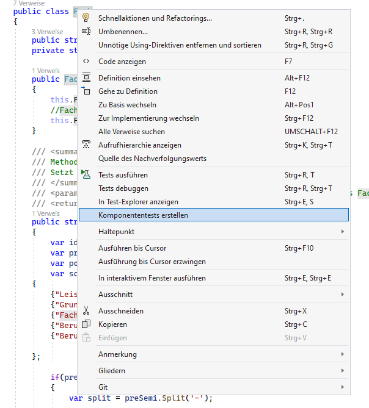
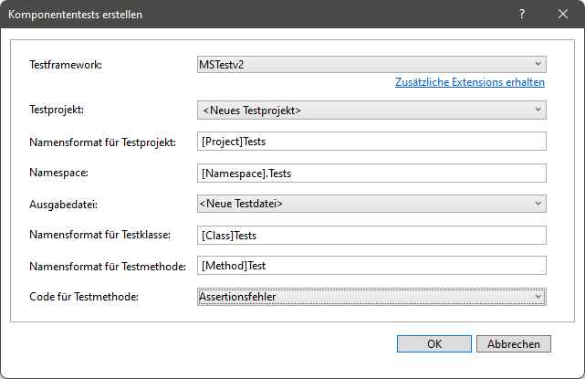
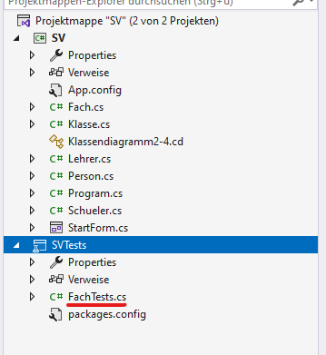
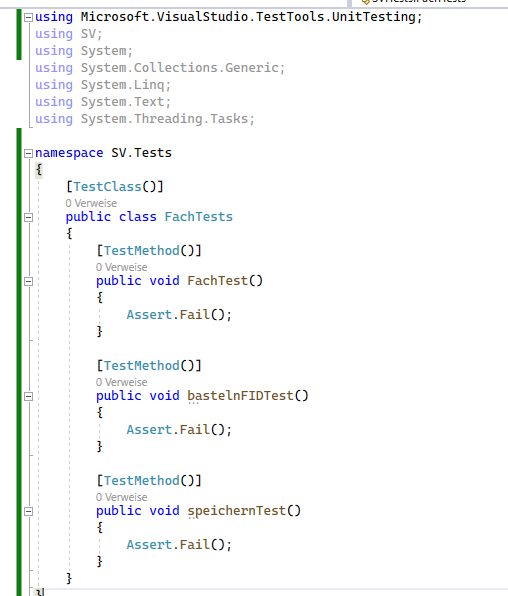
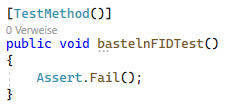
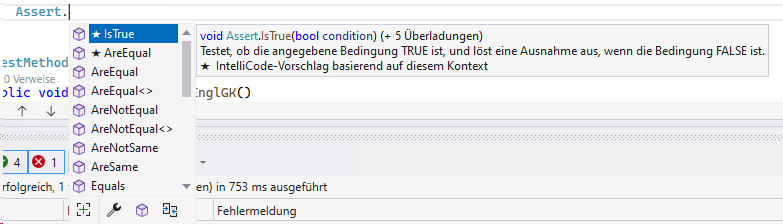
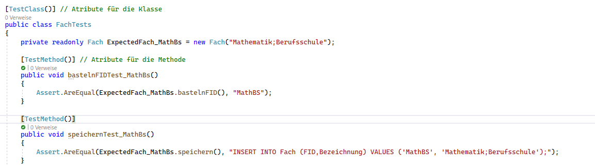
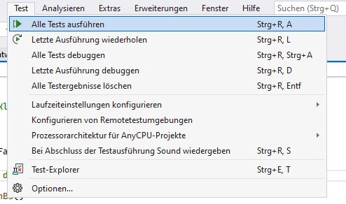
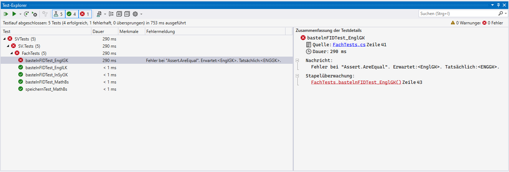

# Dokumentation zum erstellen eines automatisches Testverfahren
(Aufgabe 4 VP 2017 A2.6 Zusatz)

Diese Dokumentation soll das erstellen von Unit-Tests mithilfe von MS-Test für das .NET Framework in Visual Studio erläutern.

## Übersicht

1. [Erstellen des Testprojekts](#create)
2. [Aufbau einerTestklasse](#structure)
3. [Test operatoren](#operators)
4. [Test starten](#testing)

**Checkout oder Download des [Ausgangsprojektes](https://github.com/derech1e/SV-UnitTests/archive/refs/heads/master.zip).**

## <a name="create"></a>Erstellen des Testprojekts

Rechtsklich auf die Klasse `Fach` und auf den Kontextmenüeintrag `Komponententets erstellen` klicken.

> Um die Methode `bastelnFID` testen zu können muss diese den Zugriffsmodifizierer `public` besitzen.




Als nächstes öffnet sich ein Dialog zum erstellen eines Testprojekts. In diesem kann man verschiedene Testframeworks und Namensgebungen festlegen.

> Alle Einstellungen können so belassen werden.



Im Projektexplorer wurde nun ein neues Projekt innerhalb der Projektmappe erstellt. Dieses Projekt ist ausschließlich zum testen von Klassen und Komponenten zu verwenden.



## <a name="structure"></a>Aufbau einer Testklasse

> Eine Testklasse muss mit dem Attribut `[TestClass()]` annotiert werden. Dadurch wird diese Klasse als eine Testklasse annerkannt.



> Eine Testmethode muss mit dem Attribut `[TestMethod()]` annotiert werden. Dadurch wird diese Methode als eine Testmethode annerkannt.



Jede Testmethode wird einmal während des Tests aufgerufen und ausgeführt. Innerhalb der Methode wird die eigentliche testung der Komponente durchgeführt. Testmethoden aktzeptieren **nur** den Datentyp `void`.

## <a name="operators"></a>Assert Methode

Mithilfe der Assert Methode wird die Testlogik realisiert. `Assert` überprüft eine Bedingung auf ihre korrektheit. Wenn die Bedinung `false` ist wird eine `Exception `geworfen und der Test der Methode schlägt fehl.

> Es ist sehr hilfreich die Intellisense und die Beschreibung der jeweiligen Methoden zu lesen und benutzen.



#### Testfall #1

```csharp
Assert.AreEqual(ExpectedFach_MathBs.bastelnFID(), "MathBS");
```

> Dieser Test überprüft ob `ExpectedFach_MathBs.bastelnFID()` geleich dem gegeben `string` `MathBS` ist.

#### Testfall #2

```csharp
Assert.AreEqual(ExpectedFach_MathBs.speichern(), "INSERT INTO Fach (FID,Bezeichnung) VALUES ('MathBS', 'Mathematik;Berufsschule');");
```

> Dieser Test überprüft ob `ExpectedFach_MathBs.speichern()` geleich dem gegeben SQL-Statement `INSERT INTO Fach (FID,Bezeichnung) VALUES ('MathBS', 'Mathematik;Berufsschule');` ist.

Wenn die beide Werte gleich sind ist der Test erfolgreich.

#### Fertige Tests



## <a name="testing"></a>Test starten

Über die Menüleiste können nun alle Tests gestartet werden. Es öffnet sich ein Fenster mit einer Testübersicht.




# Die fertige Projektmappe ist unter dem Branch [Loesung ](https://github.com/derech1e/SV-UnitTests/tree/loesung)zu finden
